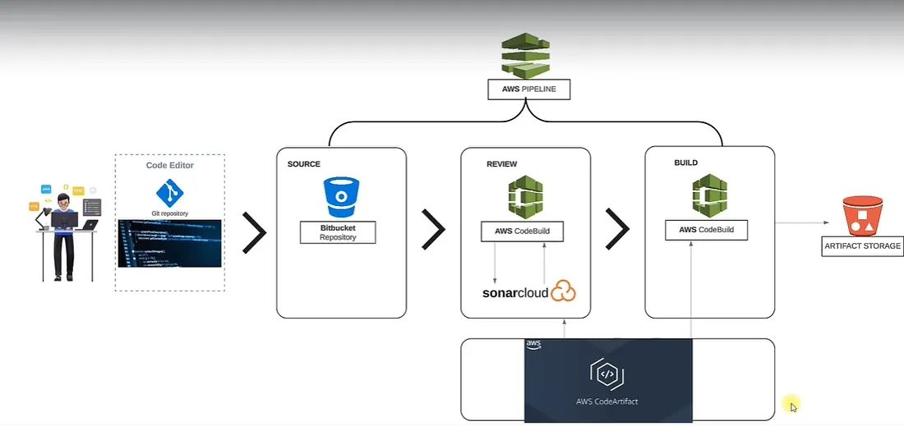

# Prerequisites
#
- JDK 18 or later
- Maven 3.9 or later
- MySQL 8 or later

# Technologies 
- Spring MVC
- Spring Security
- Spring Data JPA
- Maven
- JSP
- MySQL
# Database
Here,we used Mysql DB 
MSQL DB Installation Steps for Linux ubuntu 14.04:
- $ sudo apt-get update
- $ sudo apt-get install mysql-server

Then look for the file :
- /src/main/resources/accountsdb
- accountsdb.sql file is a mysql dump file.we have to import this dump to mysql db server
- > mysql -u <user_name> -p accounts < accountsdb.sql

#############################################################################
# Continuous Integration using AWS

This repository demonstrates a **Continuous Integration (CI) pipeline** implementation using AWS services integrated with Bitbucket, SonarCloud, Maven, and S3.

## 📌 Architecture Diagram

## 🚀 Workflow Explanation
1. **Clone the repository to Bitbucket** → Source code is pushed to Bitbucket.
2. **Pipeline Trigger** → Initiates the AWS CodeBuild job.
3. **AWS CodeBuild Job** → Executes build and runs code analysis.
4. **SonarCloud Analysis** → Performs code quality checks with quality gates.
5. **Dependency Management with Maven & CodeArtifact** → Stores and retrieves Maven dependencies securely from AWS CodeArtifact.
6. **Build Artifacts** → If tests pass, artifacts are generated.
7. **Store Artifacts in AWS S3** → Artifacts (WAR/JAR) are uploaded to S3 for storage.
8. **Notifications with SNS** → Pipeline results are sent via SNS.

## 🛠️ Steps Implemented
1. **Bitbucket Setup**
   - Created a Bitbucket repo and configured SSH authentication.
   - Migrated the vprofile project from GitHub.

2. **AWS CodeArtifact**
   - Created AWS CodeArtifact repo for dependency management.
   - Configured `pom.xml` and `settings.xml` for CodeArtifact.
   - Used `buildspec.yml` for automated builds.

3. **SonarCloud Integration**
   - Configured SonarCloud project for code analysis.

4. **AWS Parameter Store**
   - Stored SonarCloud credentials securely in Parameter Store:
     - Login Token
     - Host URL
     - Organization Name
     - Project Key

5. **AWS CodeBuild Job**
   - Configured `buildspec.yml` for dependency retrieval and code analysis.
   - Created CodeBuild project for SonarQube checks.

6. **Build Job for Artifacts**
   - Configured build job to generate artifacts (WAR/JAR).
   - Stored them in S3.

7. **AWS CodePipeline**
   - Integrated all stages: Source, Build, Test, Artifact Storage.
   - Configured **SNS notifications** for pipeline results.

---
✨ This project shows how to build a **secure, automated CI pipeline** using AWS + SonarCloud + Bitbucket.

